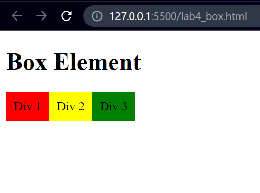
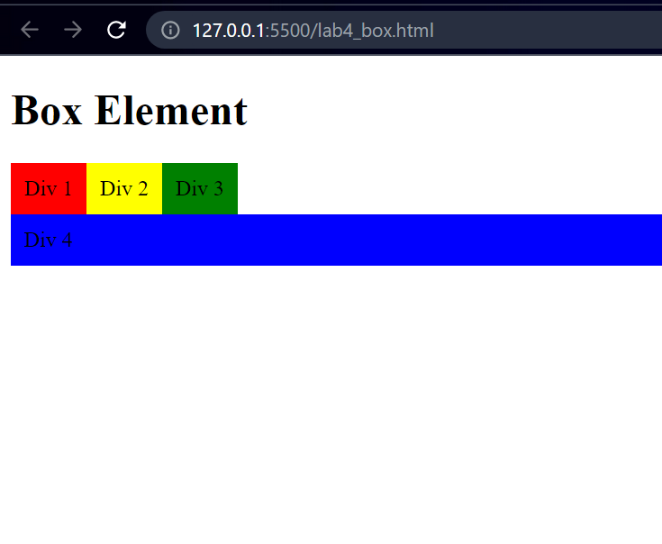
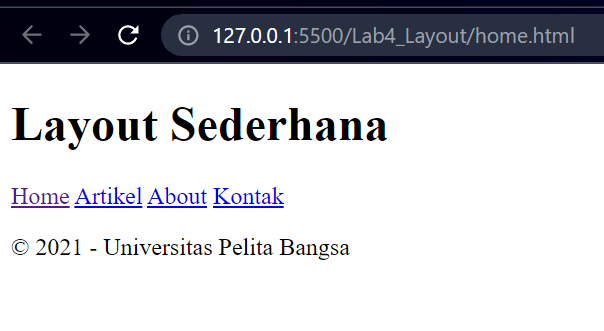
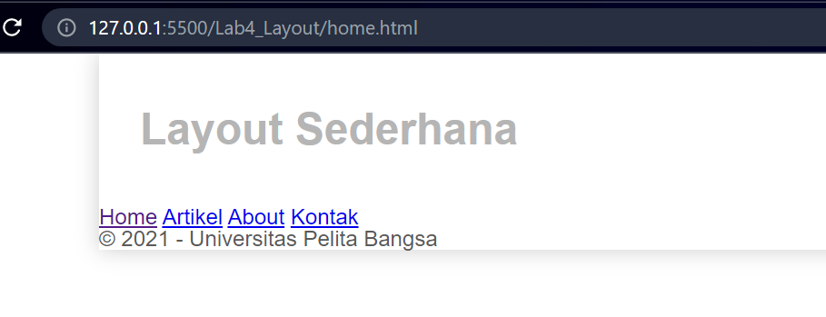
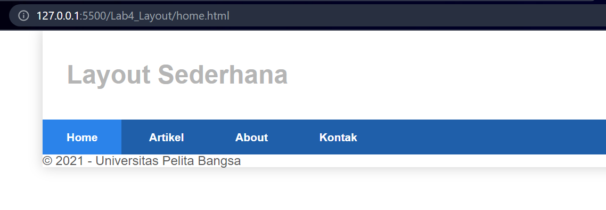

| Nama      | Shobahus Solichin |
| ----------- | ----------- |
| NIM     | 312010076       |
| Kelas   | TI.20.A.1        |

## **Langkah langkah praktikum**
Persiapan membuat dokumen HTML dengan nama file lab4_box.html seperti berikut.
```html <br>
<!DOCTYPE html>
<html lang="en">
<head>
	<meta charset="utf-8">
	<meta name="viewport" content="width=device-width, initial-scale=1">
	<title>Box Element</title>
</head>
<body>
	<header>
		<h1>Box Element</h1>
	</header>
</body>
</html>
```
## **Membuat Box Element**
Kemudian tambahkan kode untuk membuat box element dengan tag div seperti berikut.
```html <br>
<section>
		<div class="div1">Div 1</div> 
		<div class="div2">Div 2</div> 
		<div class="div3">Div 3</div>
</section>
```
## **CSS Float Property**
Selanjutnya tambahkan deklarasi CSS pada head untuk membuat float element, seperti berikut.
```css <br>
<style> 
		div{
			float:left;
		    padding: 10px;
		}
		.div1{
			background: red;
		}
		.div2{
		    background: yellow;
		}
		.div3{
			background: green;
		}
</style>
```
Kemudian buka browser untuk melihat hasilnya



## **Mengatur Clearfix Element**
Clearfix digunakan untuk mengatur element setelah float element. Property `clear` digunakan untuk
mengaturnya.

Tambahkan element div lainnya seteleah div3 seperti berikut.

```html <br>
<section>
		<div class="div1">Div 1</div> 
		<div class="div2">Div 2</div> 
		<div class="div3">Div 3</div>
		<div class="div4">Div 4</div>
</section>
```
Kemudian atur property clear pada CSS, seperti berikut.
```css <br>
.div4 {
			background-color: blue;
			clear: left;
			float: none;
}
```

Selanjutnya buka browser dan refresh kembali



Lakukan eksperimen terhadap penggunaan property clear dengan nilai lainnya (`left, both, right`),
dan amati perubahannya.

## **Membuat Layout Sederhana**

Buat folder baru dengan nama **lab4_layout**, kemudian buatlah file baru didalamnya dengan nama
**home.html**, dan file css dengan nama **style.css**.

```html <br>
<!DOCTYPE html>
<html lang="end">
<head>
	<meta charset="utf-8">
	<meta name="viewport" content="width=device-width, initial-scale=1">
	<title>Layout Sederhana</title>
	<link rel="stylesheet" type="text/css" href="style.css">
</head>
<body>
	<div id="container">

        </div>
</body>
</html>
```
Kemudian tulis kode berikut.

```html <br>
<header>
    <h1>Layout Sederhana</h1>
</header>
<nav>
    <a href="home.html" class="active">Home</a>
    <a href="artikel.html">Artikel</a>
    <a href="about.html">About</a>
    <a href="kontak.html">Kontak</a>
</nav>
<section id="hero"></section>
<section id="wrapper">
    <section id="main"></section>
    <aside id="sidebar"></aside>
</section>
<footer>
    <p>&copy; 2021 - Universitas Pelita Bangsa</p>
</footer>
```
Kemudian buka browser dan lihat hasilnya.



Kemudian tambahkan kode CSS untuk membuat layoutnya.

```css <br>
/* import google font */
@import
url('https://fonts.googleapis.com/css2?family=Open+Sans:ital,wght@0,300;0,400 ;0,600;0,700;0,800;1,300;1,400;1,600;1,700;1,800&display=swap');
@import url('https://fonts.googleapis.com/css2?family=Open+Sans+Condensed:ital,wght@0 ,300;0,700;1,300&display=swap');
/* Reset CSS */
*{
	margin: 0;
	padding: 0; 
}
body{ 
	line-height:1;
	font-size:100%;
	font-family:'Open Sans', sans-serif; 
	color:#5a5a5a;
}
#container{
    width: 980px;
    margin: 0 auto;
	box-shadow: 0 0 1em #cccccc; 
}

/* header */
header{
    padding: 20px;
}
header h1{
    margin: 20px 10px;
    color: #b5b5b5;
}
```
Kemudian lihat hasilnya pada browser.



## **Membuat Navigasi**
Kemudian selanjutnya mengatur navigasi.
```css <br>
/* navigasi */
nav{
    display: block;
	background-color: #1f5faa; 
}
nav a {
	padding: 15px 30px; 
	display: inline-block; 
	color: #ffffff; 
	font-size: 14px; 
	text-decoration: none; 
	font-weight: bold;
}
nav a.active, 
nav a:hover{
	background-color: #2b83ea; 
}
```
Kemudian lihat hasilnya.



## **Membuat Hero Panel.**
Selanjutnya membuat hero panel. Tambahkan kode HTML dan CSS seperti berikut.
```html <br>
<section id="hero">
			<h1>Hello World!</h1>
			<p>Lorem ipsum dolor sit amet, consectetur adipiscing elit. Vestibulum lorem elit, iaculis innisl volutpat, malesuada tincidunt arcu. Proin in leo fringilla, vestibulum mi porta, faucibus felis. Integer pharetra est nunc, nec pretium nunc pretium ac.</p>
			<a href="home.html" class="btn btn-large">Learn more &raquo;</a>
</section> 
```
```css <br>
/* Hero Panel */
#hero{
	background-color: #e4e4e5; 
	padding: 50px 20px; 
	margin-bottom: 20px;
}
#hero h1{ 
	margin-bottom: 20px; 
	font-size: 35px;
}
#hero p{ 
	margin-bottom: 20px; 
	font-size: 18px; 
	line-height: 25px;
}
```


## **Mengatur Layout Main dan Sidebar**
Selanjutnya mengatur main content dan sidebar, tambahkan CSS float.
```css <br>
/* main content */
#wrapper {
    margin: 0;
}
#main {
    float: left;
    width: 640px;
    padding: 20px;
}
/* sidebar area */
#sidebar {
    float: left;
    width: 260px;
    padding: 20px;
}
```
## **Membuat Sidebar Widget**
Kemudian selanjutnya menambahkan element lain dalam sidebar.
```html <br>
<aside id="sidebar">
				<div class="widget-box">
					<h3 class="title">Widget Header</h3> 
					<ul>
						<li>
							<a href="#">Widget Link</a>
						</li> 
						<li>
							<a href="#">Widget Link</a>
						</li> 
						<li>
							<a href="#">Widget Link</a>
						</li> 
						<li>
							<a href="#">Widget Link</a>
						</li> 
						<li>
							<a href="#">Widget Link</a>
						</li>
					</ul> 
				</div>
				<div class="widget-box">
					<h3 class="title">Widget Text</h3>
					<p>Vestibulum lorem elit, iaculis in nisl volutpat, malesuada tincidunt
					arcu. Proin in leo fringilla, vestibulum mi porta, faucibus felis. Integer pharetra est nunc, nec pretium nunc pretium ac.</p>
				</div>
			</aside> 
```